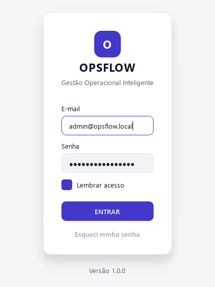
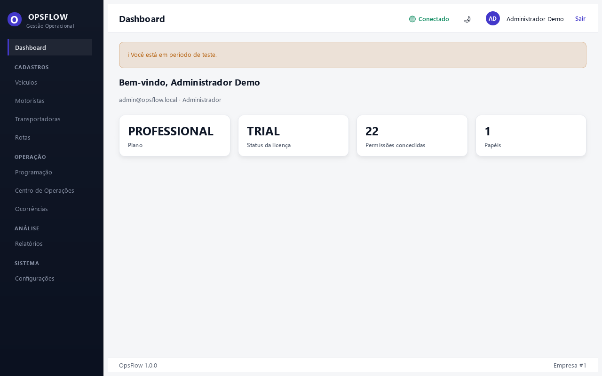
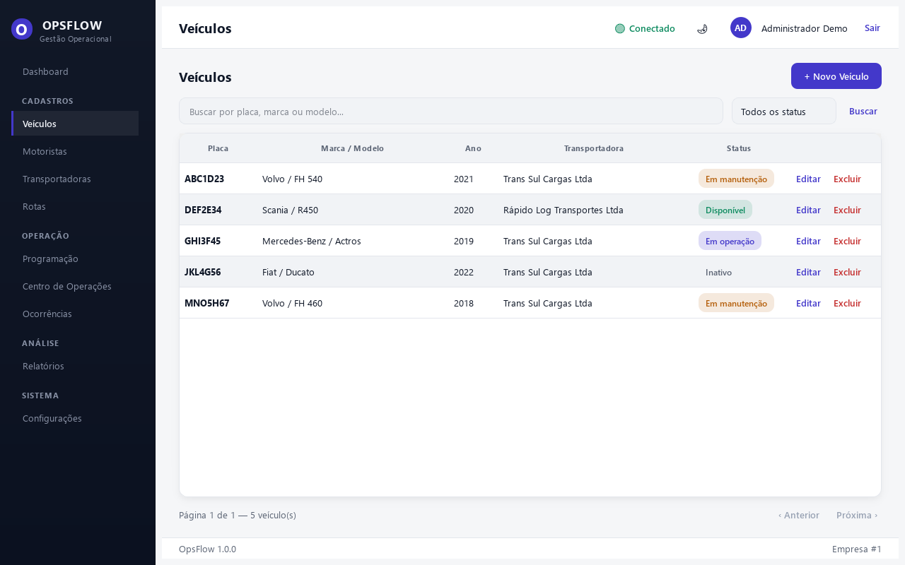
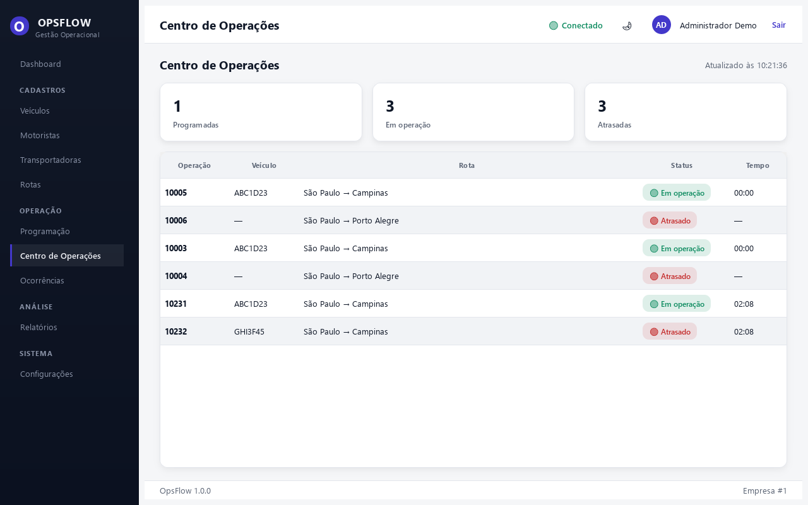
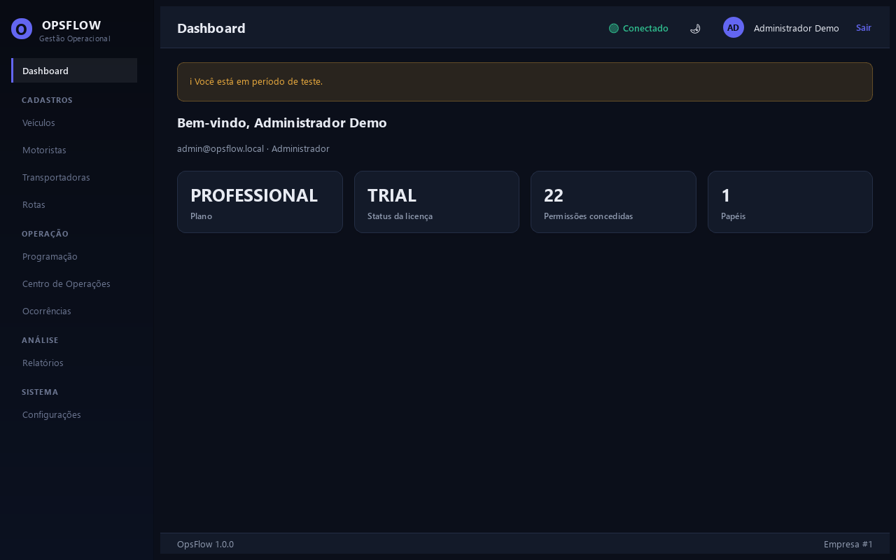

<div align="center">

# OpsFlow

**Gestão Operacional Inteligente**

Plataforma SaaS/desktop multi-tenant de gestão operacional e logística — para
empresas que hoje controlam sua operação em planilhas, WhatsApp e controles
manuais.


-41CD52?logo=qt&logoColor=white)


</div>

> **Status do projeto:** em desenvolvimento por fases, construído sobre uma
> especificação funcional completa. Este README reflete exatamente o que
> está implementado e testado agora — nada aqui é aspiracional. Ver
> [Roadmap](#-roadmap) para o que falta.

## Sumário

- [Capturas de tela](#-capturas-de-tela)
- [Funcionalidades](#-funcionalidades)
- [Arquitetura](#-arquitetura)
- [Stack](#-stack)
- [Instalação](#-instalação-desenvolvimento)
- [Desenvolvimento](#-desenvolvimento)
- [Docker](#-docker)
- [Testes](#-testes)
- [Segurança](#-segurança)
- [Roadmap](#-roadmap)

## 📸 Capturas de tela

<table>
<tr>
<td width="50%"></td>
<td width="50%"></td>
</tr>
<tr>
<td width="50%"></td>
<td width="50%"></td>
</tr>
</table>

<details>
<summary>Tema escuro</summary>

</details>

## ✅ Funcionalidades

Implementado, testado e rodando contra MySQL real — não protótipo visual:

| Módulo | O que tem |
|---|---|
| **Arquitetura & multi-tenant** | Schema completo (30 tabelas), isolamento por `tenant_id` centralizado em `TenantRepository`, RBAC com 5 papéis e matriz de permissões, catálogo de planos, migrations Alembic |
| **Autenticação** | Login/refresh/logout com JWT + refresh token rotativo, bloqueio por tentativas excessivas, RBAC ponta a ponta |
| **Cadastros** | Veículos, Motoristas, Transportadoras e Rotas — CRUD completo: busca, filtros, paginação, validação de duplicidade, soft delete, auditoria, máscara de CPF/CNPJ/telefone |
| **Operações** | Programação operacional com timeline de status automática (`schedule → operation → status_history`), Centro de Operações ao vivo (contadores + quadro de operações, seção 21 da spec) |
| **Notificações & automações** | 3 robôs em background (APScheduler): detecção automática de atraso, alerta de CNH vencendo, expiração automática de licença — cada um notifica os administradores da empresa sozinho |
| **Licenciamento** | Licença por tenant (`ACTIVE`/`TRIAL`/`SUSPENDED`/`EXPIRED`/`CANCELLED`), validada pela API a cada login, enforcement do limite de veículos/usuários do plano |
| **Desktop (PySide6)** | Login, shell navegável (sidebar por seção, tema claro/escuro, indicador de conexão), todas as telas acima já com visual final |

Planejado, fase a fase — ver [ARCHITECTURE.md](docs/ARCHITECTURE.md) e a
seção [Roadmap](#-roadmap).

## 🏗️ Arquitetura

```
        Desktop (PySide6)  --HTTPS/JWT-->  API (FastAPI)  -->  MySQL 8 (SQLAlchemy 2.x)
                                                  │
                                                  ├─→ Redis (cache/jobs, reservado)
                                                  └─→ APScheduler (robôs em background)
```

Detalhes completos, modelo de dados, fluxo de autenticação e de
licenciamento: [docs/ARCHITECTURE.md](docs/ARCHITECTURE.md) e
[docs/DATABASE.md](docs/DATABASE.md).

## 🧱 Stack

| Camada | Tecnologia |
|---|---|
| Backend | Python 3.12+, FastAPI, SQLAlchemy 2.x, Pydantic v2, Alembic |
| Banco | MySQL 8+ / MariaDB (produção e dev); SQLite isolado nos testes automatizados |
| Autenticação | JWT (access + refresh), senha com Argon2id |
| Jobs | APScheduler (detecção de atraso, alertas de CNH, expiração de licença) |
| Desktop | Python, PySide6 (Qt) |
| Cache | Redis *(reservado para quando o volume justificar)* |
| Empacotamento | PyInstaller + Inno Setup *(Fases 8/10)* |

## 🚀 Instalação (desenvolvimento)

Pré-requisitos: Python 3.12+, e **ou** Docker Desktop **ou** um MySQL 8/MariaDB
acessível (ex. via XAMPP).

```bash
git clone <repo> opsflow && cd opsflow
python -m venv .venv
./.venv/Scripts/pip install -r requirements.txt   # Windows
# .venv/bin/pip install -r requirements.txt       # Linux/macOS

cp .env.example .env
# edite .env: gere um JWT_SECRET
#   python -c "import secrets; print(secrets.token_urlsafe(64))"
# e aponte DATABASE_URL para o seu MySQL (ou deixe sqlite:///./opsflow_dev.db
# para rodar sem nenhum banco externo instalado)
```

## 🛠️ Desenvolvimento

```bash
# aplicar o schema
alembic -c database/migrations/alembic.ini upgrade head

# popular dados de demonstração (empresa, usuário admin, veículos, ...)
python database/seeds/seed_demo.py

# subir a API com reload automático (a partir da raiz do projeto)
uvicorn app.main:app --app-dir backend --reload
# docs interativas em http://127.0.0.1:8000/docs

# abrir o desktop (com a API acima já rodando)
python desktop/main.py
```

## 🐳 Docker

```bash
cp .env.example docker/.env   # preencha JWT_SECRET, MYSQL_* se quiser customizar
docker compose -f docker/docker-compose.yml up -d
```

Sobe `api` (porta 8000) + `mysql` (3306) + `redis` (6379). Depois, de dentro
do container ou apontando `DATABASE_URL` para `localhost:3306`, rode as
migrations normalmente.

## 🧪 Testes

```bash
pytest                 # roda tests/backend com cobertura (ver pyproject.toml)
```

48 testes automatizados, sempre contra um SQLite isolado (nunca o banco de
desenvolvimento) — cobrindo autenticação, isolamento multi-tenant com dados
reais de duas empresas (seções 52/53 da spec), CRUD de todos os cadastros,
o fluxo de programação/status/timeline e os 3 robôs em background.

## 🔐 Segurança

HTTPS, JWT com refresh rotativo, hash Argon2id, bloqueio após tentativas
excessivas de login, isolamento por tenant, auditoria, segredos somente via
variável de ambiente (nunca no código-fonte). Detalhes e o que ainda está
pendente (hardening): Fase 11, documentado futuramente em `docs/SECURITY.md`.

## 🗺️ Roadmap

| Fase | Conteúdo | Status |
|---|---|---|
| 1 | Estrutura, banco, migrations, backend skeleton, config, Docker | ✅ Concluída |
| 2 | Autenticação e multi-tenancy | ✅ Concluída |
| 3 | Cadastros (veículos, motoristas, transportadoras, rotas) | ✅ Concluída |
| 4 | Operações (programação, timeline, status) | ✅ Concluída |
| — | Notificações + automações em background *(adiantado da seção 41)* | ✅ Concluída |
| 5 | Dashboard | Planejada |
| 6 | Relatórios/exportação | Planejada |
| 7 | Licenciamento (endpoints + enforcement) | 🔶 Parcial — enforcement de limite de veículos já ativo |
| 8 | Desktop (PySide6) | 🔶 Em andamento — login, shell, cadastros e operações prontos; faltam dashboard/relatórios |
| 9 | Testes (cobertura ampla, isolamento multi-tenant) | 🔶 Em andamento — 48 testes já cobrem os módulos acima |
| 10 | Build e instalador | Planejada |
| 11 | Hardening de segurança | Planejada |
| 12 | Documentação final | Planejada |

Visão de mais longo prazo (mapas/GPS, integrações, IA, mobile):
[ARCHITECTURE.md](docs/ARCHITECTURE.md).

---

<div align="center">

**Licença:** software proprietário — todos os direitos reservados.

</div>
